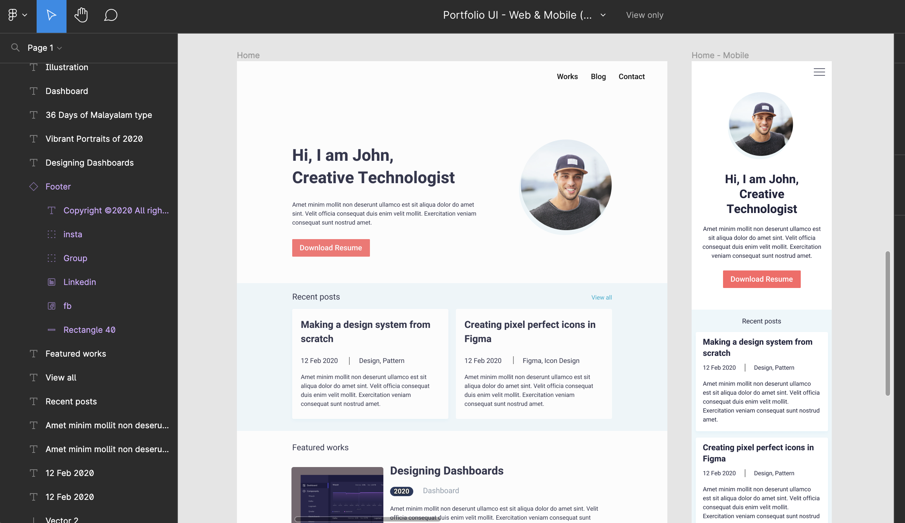
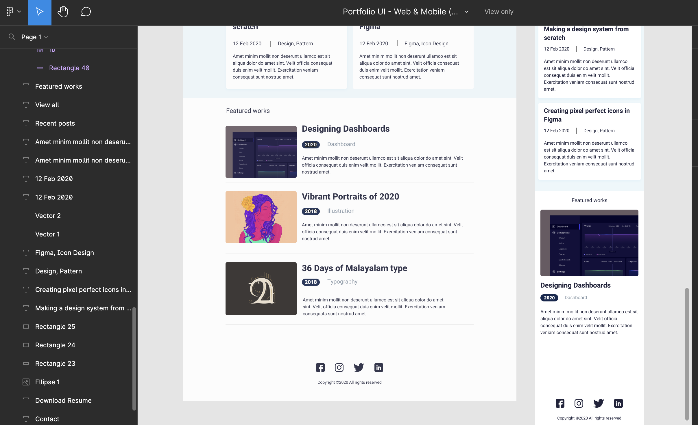

# Build this project with tailwind
---

I was asked by a client to build this **figma project** with == tailwind == . 
It was an amazing experience for me.

###Screenshots:
  

 

### Technogies used

- HTML 

- Tailwind
